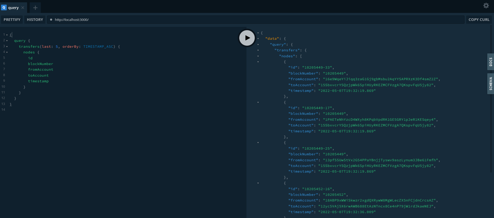

# [Polkadot Quick Start](https://academy.subquery.network/quickstart/quickstart_chains/polkadot.html)

1. `subql init`, 类似于包管理新建项目, 配置信息在 package.json
2. `yarn install`, 安装项目依赖到 src/node_modules
3. 需要修改的重要文件:
   * schema.graphql: GraphQL 模式, 定义 `@entity`, 每个实体必须有 `id: ID!` 作为主键 (`!` 表示非空), 运行 `yarn codegen`, 生成 src/types
   * project.yaml: 项目清单, 处理索引和转换链上数据
   * src/mappings/: 映射函数, 处理数据的逻辑, 运行 `yarn build`
     * `handleBlock`
     * `handleEvent`: [API](https://polkadot.js.org/docs/substrate/events/)
     * `Call Handlers`
4. `yarn start:docker`, 启动 docker-compose.yml 定义的 docker 节点

> topic:
> 
> a basic demo to index polkadot main network.
> 
> requirement:
> get account transfer event list, where block number > 10159783.
> we can filter the transfer event by the specified method "balances.Transfer".
> 
> 
> what you need:
> 1. polkadot main network.
> https://polkadot.js.org/apps/?rpc=wss%3A%2F%2Fpolkadot.api.onfinality.> io%2Fpublic-ws#/explorer
> 
> 2. an data index  framework.
> SubQuery
> https://explorer.subquery.network/
> 
> 
>  
> what expect:
> sample table schema: 
> 
> ```
> id	block_number	from_account	to_account	balance_change	timestamp
> 1	10159784		0x123			0x456		 100000000		2022-05-04 10:00:00
> 2	10159786		0xabc			0xdef		 2500000000		2022-05-04 10:00:45
> ```



----

# SubQuery - Starter Package

The Starter Package is an example that you can use as a starting point for developing your SubQuery project.
A SubQuery package defines which data The SubQuery will index from the Substrate blockchain, and how it will store it.

## Preparation

#### Environment

- [Typescript](https://www.typescriptlang.org/) are required to compile project and define types.

- Both SubQuery CLI and generated Project have dependencies and require [Node](https://nodejs.org/en/).

#### Install the SubQuery CLI

Install SubQuery CLI globally on your terminal by using NPM:

```
npm install -g @subql/cli
```

Run help to see available commands and usage provide by CLI

```
subql help
```

## Initialize the starter package

Inside the directory in which you want to create the SubQuery project, simply replace `project-name` with your project name and run the command:

```
subql init --starter project-name
```

Then you should see a folder with your project name has been created inside the directory, you can use this as the start point of your project. And the files should be identical as in the [Directory Structure](https://doc.subquery.network/directory_structure.html).

Last, under the project directory, run following command to install all the dependency.

```
yarn install
```

## Configure your project

In the starter package, we have provided a simple example of project configuration. You will be mainly working on the following files:

- The Manifest in `project.yaml`
- The GraphQL Schema in `schema.graphql`
- The Mapping functions in `src/mappings/` directory

For more information on how to write the SubQuery,
check out our doc section on [Define the SubQuery](https://doc.subquery.network/define_a_subquery.html)

#### Code generation

In order to index your SubQuery project, it is mandatory to build your project first.
Run this command under the project directory.

```
yarn codegen
```

## Build the project

In order to deploy your SubQuery project to our hosted service, it is mandatory to pack your configuration before upload.
Run pack command from root directory of your project will automatically generate a `your-project-name.tgz` file.

```
yarn build
```

## Indexing and Query

#### Run required systems in docker

Under the project directory run following command:

```
docker-compose pull && docker-compose up
```

#### Query the project

Open your browser and head to `http://localhost:3000`.

Finally, you should see a GraphQL playground is showing in the explorer and the schemas that ready to query.

For the `subql-starter` project, you can try to query with the following code to get a taste of how it works.

```graphql
{
  query {
    starterEntities(first: 10) {
      nodes {
        field1
        field2
        field3
      }
    }
  }
}
```
